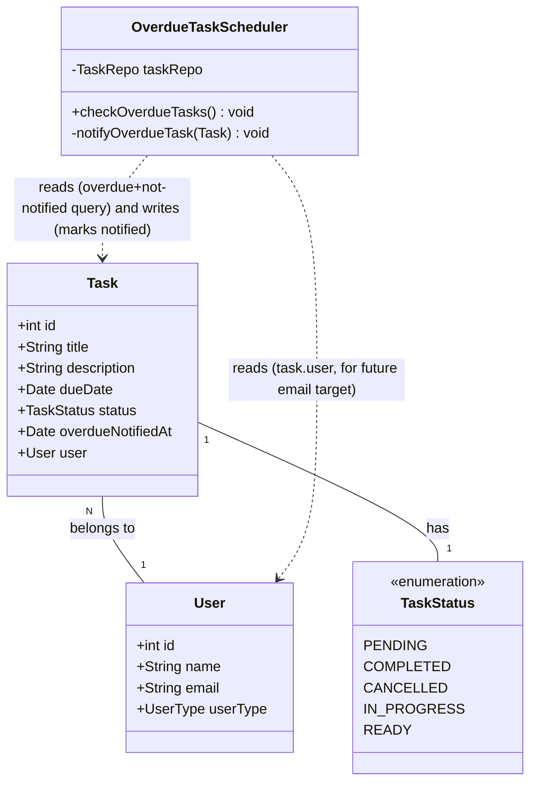

# Overdue Task Check Scheduler

## Requirements
Implement a periodic overdue-task detector that continuously surfaces tasks past their due date exactly once per overdue occurrence, laying the groundwork for future email alerts while, for this iteration, only recording each first-time detection via application logs.

## Entities

`Task` gains one new nullable attribute, `overdueNotifiedAt` (`Date`), to persist already-notified tracking (Conservative Constraint: extend the existing entity rather than introduce a new one). `TaskStatus` and `User` are unchanged. No new DTOs are introduced — `OverdueTaskScheduler` is a new, non-persisted component that reads and writes through the existing `Task` model via a new repository query and the existing `save` method.

## Approach
1. Scheduling Strategy:
   - Use Spring's native scheduling (`@EnableScheduling` + `@Scheduled(fixedRate = 10000)`) rather than an external scheduler (Quartz, message queue), since no such infrastructure exists in the project and the requirement is a single fixed 10-second interval on a single application instance.
   - Enable scheduling once on the application entry point (`TaskManagementApplication`) rather than a separate configuration class, keeping the footprint minimal for this single scheduled job.

2. Detection & Notify-Once Strategy:
   - Derive "overdue" at query time rather than persisting an `OVERDUE` status: a task is overdue when `dueDate` is before the current time AND its `status` is not a terminal state (`COMPLETED`, `CANCELLED`).
   - Track already-notified state via a new nullable `Task.overdueNotifiedAt` field rather than an in-memory set, since in-memory tracking would be lost on every application restart. The overdue query filters out tasks that already have `overdueNotifiedAt` set, so each task's log line fires exactly once per overdue occurrence rather than on every 10-second cycle.
   - Add one new `@Query` method to `TaskRepo` following the exact style of the existing `findTaskByTitle`/`findTaskByDescription` methods (JPQL string, implicit named-parameter binding, no `@Param` annotations — matching current codebase convention).
   - After logging a task, persist the notified marker via `taskRepo.save(task)`, mirroring the existing save pattern already used in `TaskService.addTask`/`updateTask`.

3. Notification Strategy (this iteration):
   - Introduce a single new component, `OverdueTaskScheduler`, that owns the scheduled trigger and the per-task notify step (log + mark-notified). Do not introduce a separate email-abstraction interface yet — the project has no mail dependency and no prior notification abstraction to extend, so building one now would be speculative (Conservative Constraint: avoid unnecessary refactoring/abstraction).
   - For each newly-overdue (not-yet-notified) task found, log one line via SLF4J (`@Slf4j`, `log.info`) — mirroring the exact logging convention already used in `TaskService` and `AdminService` — then set `overdueNotifiedAt` and save.
   - Mark the email step with an explicit inline comment noting it is intentionally not implemented yet, so the deferred work is discoverable without building unused scaffolding.

4. Business Logic:
   - Overdue scope excludes `COMPLETED` and `CANCELLED` tasks (business rule: a finished or cancelled task is not "overdue" even if its due date has passed).
   - Each task's notification (log line now, email later) fires exactly once per overdue occurrence — governed by `overdueNotifiedAt`. Resetting the marker (e.g., if a task's due date is later pushed forward and it becomes overdue again) is explicitly out of scope for this iteration and is not implemented.
   - Failures while processing one task must not abort the rest of the scheduled run — isolate per-task work (log + save) so one bad record doesn't silently stop detection for all other overdue tasks.
   - No REST endpoint, request DTO, or response DTO is introduced — this is a background process with no external trigger, so no `GlobalExceptionHandler` wiring is needed for this feature (there is no controller entry point to catch exceptions at).

## Structure

### Inheritance Relationships
1. No new interfaces or abstract classes are introduced.
2. `OverdueTaskScheduler` is a plain Spring-managed class (`@Component`), consistent with `TaskService`/`AdminService` being plain `@Service` classes with no shared base class.

### Dependencies
1. `OverdueTaskScheduler` depends on `TaskRepo` (field-injected via `@Autowired`, matching the existing injection style in `TaskService`/`AdminService`).
2. `TaskRepo` gains one new query method; no new repository is introduced.
3. `Task` gains one new column (`overdueNotifiedAt`); no new entity is introduced.
4. `TaskManagementApplication` gains `@EnableScheduling` to activate the Spring `TaskScheduler` that drives `OverdueTaskScheduler`.

### Layered Architecture
1. Controller Layer: Unchanged — this feature has no HTTP-triggered entry point.
2. Scheduler Layer (new): `OverdueTaskScheduler` — owns the time-driven trigger and per-task overdue handling (detection + logging + notified-marking + deferred-email marker). Kept separate from the Service Layer to avoid mixing time-driven cross-cutting logic into CRUD services.
3. Repository Layer: `TaskRepo` — gains an overdue-and-not-yet-notified query, following its existing `@Query`-based finder convention.
4. Data Access Layer: Spring Data JPA / PostgreSQL — gains one new nullable column on the existing `tasks` table (`overdueNotifiedAt`), auto-applied via `spring.jpa.hibernate.ddl-auto=update` (no manual migration required, consistent with how this project already manages schema evolution).
5. Exception Handling Layer: Not applicable to this feature — no `GlobalExceptionHandler` involvement since there is no controller/API surface; failures are contained locally within the scheduled method (see Operations).

## Operations

### Update Entity - Task
1. Responsibility: Persist whether a task's current overdue occurrence has already been notified.
2. Attributes:
   - `overdueNotifiedAt`: `Date` - nullable; `null` means the task has not yet been notified for its current overdue occurrence; a non-null value is the timestamp of the first detection.
3. Annotations: `@Column(name = "overdueNotifiedAt", nullable = true)` on the new field, consistent with the `@Column` style already used on `Task`'s other fields.
4. Constraints: Must remain nullable and must default to `null` for all existing and newly created tasks (no backfill logic required — new tasks simply start as not-yet-notified).

### Update Repository - TaskRepo
1. Responsibility: Add a read-only query method that returns overdue tasks which have not yet been notified.
2. Methods:
   - `findOverdueTasks(Date now, List<TaskStatus> excludedStatuses)`: `List<Task>`
     - Logic:
       - Execute JPQL: `select t from Task t where t.dueDate < :now and t.status not in :excludedStatuses and t.overdueNotifiedAt is null`
       - Bind `now` and `excludedStatuses` implicitly by parameter name, matching the existing `findTaskByTitle`/`findTaskByDescription` convention in the same file (no `@Param` annotations).
       - Return an empty list (not null) when no tasks match — default `JpaRepository`/JPQL behavior, no extra null-handling needed.
3. Annotations: `@Query("select t from Task t where t.dueDate < :now and t.status not in :excludedStatuses and t.overdueNotifiedAt is null")`
4. Constraints: The query itself remains read-only; marking a task as notified is a separate write performed by the caller (`OverdueTaskScheduler`) via the existing `save` method, not by this query.

### Create Component - OverdueTaskScheduler
1. Responsibility: Periodically detect newly-overdue (not-yet-notified) tasks and, for each one found, log a detection line and mark it as notified so it is not logged again; email dispatch is intentionally not implemented in this iteration.
2. Attributes:
   - `taskRepo`: `TaskRepo` - injected dependency used to fetch and update overdue tasks.
   - `EXCLUDED_STATUSES`: `List<TaskStatus>` (static final) - `{COMPLETED, CANCELLED}`, the terminal statuses excluded from overdue evaluation.
3. Methods:
   - `checkOverdueTasks()`: `void`
     - Logic:
       - Call `taskRepo.findOverdueTasks(new Date(), EXCLUDED_STATUSES)` to fetch the current overdue-and-not-yet-notified set.
       - Iterate the result; for each `Task`, invoke `notifyOverdueTask(task)`.
       - Wrap the per-task call in a try/catch that logs the failure (`log.error`) and continues to the next task, so one failing task does not stop the rest of the run.
       - If the result list is empty, no log output is produced for that run (avoid unnecessary "no overdue tasks" noise every 10 seconds).
   - `notifyOverdueTask(Task task)`: `void` (private)
     - Logic:
       - Log one line at `info` level identifying the task (id, title, due date) so operators can see which task was detected as overdue, e.g. `log.info("Overdue task detected. Task Id: {}, Title: {}, DueDate: {}", task.getId(), task.getTitle(), task.getDueDate())`.
       - Include an inline comment directly above (or on) the email step noting that email sending is intentionally deferred and not yet implemented — no email-sending call is made.
       - Set `task.setOverdueNotifiedAt(new Date())` and call `taskRepo.save(task)` so this task is excluded from subsequent scheduled runs.
4. Annotations: `@Component`, `@Slf4j`, `@Scheduled(fixedRate = 10000)` on `checkOverdueTasks()`.
5. Constraints: The class must not modify any `Task` field other than `overdueNotifiedAt` — it must not change `status` or any other persisted field.

### Update Application Entry Point - TaskManagementApplication
1. Responsibility: Activate Spring's scheduling infrastructure so `@Scheduled` methods run.
2. Methods: No new methods — add the `@EnableScheduling` annotation to the existing `@SpringBootApplication`-annotated class.
3. Annotations: `@EnableScheduling` (in addition to the existing `@SpringBootApplication`).
4. Constraints: This is the only infrastructure change required to make scheduling active; no separate `@Configuration` class is needed for a single scheduled job.

## Norms
1. Annotation Standards: New Spring-managed classes use `@Component` for non-CRUD, non-REST components (as opposed to `@Service` for business/CRUD logic and `@RestController` for HTTP endpoints) — `OverdueTaskScheduler` follows this by using `@Component`, not `@Service`. New entity columns use the same `@Column` style already present on `Task`.
2. Dependency Injection: Field injection via `@Autowired`, matching the existing style used throughout `TaskService`, `AdminService`, and `UserService` — do not introduce constructor injection as a new pattern in this change.
3. Exception Handling:
   - No new custom exception types are introduced by this feature.
   - Failures during per-task processing (log + save) inside `OverdueTaskScheduler.checkOverdueTasks()` must be caught locally (try/catch around the per-task call) and logged at `error` level with the task id — they must never propagate out of the scheduled method, since an uncaught exception in a `@Scheduled` method silently stops future executions in Spring's default scheduler.
   - No `GlobalExceptionHandler` involvement — this feature has no controller/API entry point.
4. Data Validation: No new user-supplied input is introduced (no request DTO), so no new validation annotations are required. The overdue query relies on existing non-null constraints already enforced on `Task.dueDate` and `Task.status`; `overdueNotifiedAt` is intentionally nullable and requires no validation.
5. Logging: Use Lombok's `@Slf4j` and parameterized `log.info(...)`/`log.error(...)` calls (never string concatenation), exactly matching the pattern already established in `TaskService.addTask`/`TaskService.updateTask`/`TaskService.deleteTaskById` and `AdminService`.
6. Documentation Standards: No Javadoc blocks are used elsewhere in the codebase (see `Task`, `TaskService`); follow suit — at most a single inline comment marking the deferred email step, no multi-line comment blocks.

## Safeguards
1. Functional Constraints: The scheduler must detect a task as overdue only when `dueDate` is strictly before the current time AND `status` is not `COMPLETED` or `CANCELLED` AND `overdueNotifiedAt` is `null`. Once notified, a task must not be logged again by this feature, even on subsequent scheduled runs.
2. Performance Constraints: The overdue query must run in well under the 10-second scheduling interval under current expected data volumes (no pagination or batching is required at this stage); if task volume grows large enough to risk exceeding the interval, that must be treated as a future follow-up, not solved in this change.
3. Security Constraints: No new externally-reachable surface is introduced (no controller, no new endpoint) — this feature has no direct security-boundary impact. Logged lines must not include `User.email` or any other PII beyond task id/title/due date.
4. Integration Constraints: No new dependency (e.g., `spring-boot-starter-mail`) may be added to `pom.xml` as part of this change — the email step must remain a no-op/log-only placeholder until a follow-up requirement defines the actual email behavior.
5. Business Rule Constraints: `EXCLUDED_STATUSES` must be exactly `{COMPLETED, CANCELLED}` — no other statuses are excluded from the overdue check unless a future requirement changes this rule. `overdueNotifiedAt`, once set, must never be reset or cleared by this feature — resetting on due-date changes or status transitions is explicitly out of scope for this iteration.
6. Exception Handling Constraints:
   - A failure while processing a single overdue task (logging or saving) must be caught and logged, and must not prevent other tasks in the same run (or subsequent scheduled runs) from being processed.
   - No sensitive internal details (stack traces, SQL) may be logged at `info` level; use `error` level for failures with only the task id and a concise message.
7. Technical Constraints: The scheduled interval must be implemented as `@Scheduled(fixedRate = 10000)` (milliseconds) — do not substitute a cron expression or a different interval unit. The overdue comparison must use `java.util.Date` (matching `Task.dueDate`'s existing type) — do not introduce `java.time.*` types into `Task` or the query as part of this change.
8. Data Constraints: The new `TaskRepo` query must not mutate any row (no `@Modifying`, no writes) — it is read-only by construction; the write that marks a task notified must go through the existing `taskRepo.save(task)` path, not a bulk update query.
9. API Constraints: Not applicable — this feature introduces no REST endpoint, request DTO, or response DTO.
